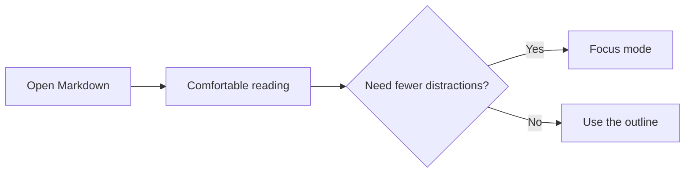

# Markdown Cheat Sheet

A private, offline reference for the Markdown syntax supported by Markdown Reader.

---

## Headings

# Heading 1

## Heading 2

### Heading 3

#### Heading 4

##### Heading 5

###### Heading 6

---

## Text formatting

Use **bold text**, *italic text*, ***bold italic text***, ~~strikethrough~~, and `inline code`.

> Blockquotes set quoted material apart from the surrounding document.
>
> They can contain multiple paragraphs and **formatted text**.

## Links

[Visit the Markdown Guide](https://www.markdownguide.org/) for more examples. External links open safely in a new tab.

Relative links work after you explicitly open their containing folder.

## Lists

### Unordered list

- First item
- Second item
  - Nested item
- Third item

### Ordered list

1. Open a Markdown file.
2. Adjust the reading preferences.
3. Enter Focus mode.

### Task list

- [x] Open a document
- [x] Read GitHub-flavored Markdown
- [ ] Take a well-earned break

## Table

| Feature | Supported | Notes |
| :--- | :---: | ---: |
| Tables | Yes | GFM |
| Task lists | Yes | Read-only |
| Local images | Yes | Requires folder access |

## Code

Inline code uses backticks: `const reader = "local"`.

```javascript
function greet(name) {
  return `Hello, ${name}!`;
}

console.log(greet('reader'));
```

```python
def reading_time(words: int) -> int:
    return max(1, round(words / 225))
```

## Math

Inline math: $E = mc^2$

Display math:

$$
\frac{-b \pm \sqrt{b^2 - 4ac}}{2a}
$$

## Mermaid diagram



---

## Escaping characters

Add a backslash before Markdown punctuation to display it literally: \*not italic\*.

## Horizontal rule

Three hyphens, asterisks, or underscores on their own line create a divider like the ones in this document.
