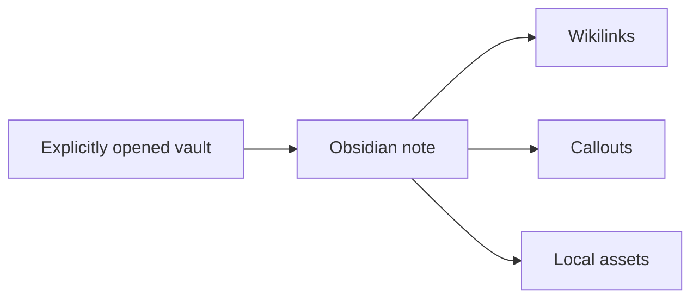

# Obsidian Markdown Cheat Sheet

Markdown Reader supports a focused, read-only subset of Obsidian syntax. Vault notes and assets resolve only after you explicitly open their folder.

## Wikilinks

- Link to a note: [[Daily note]]
- Link with an alias: [[Zettelkasten|the slip-box method]]
- Link to a heading: [[Zettelkasten#Workflow|Zettelkasten › Workflow]]
- Link inside this note: [[#Callouts]]

## Embeds

Embedded notes appear as safe navigation controls: ![[Daily note]]

Image embeds such as `![[diagram.png|300]]` resolve inside an opened folder and respect the optional width.

## Callouts

> [!tip] Callouts can have a custom title
> Use `tip`, `info`, `warning`, `danger`, or `bug` to communicate intent.

> [!warning]- Foldable syntax
> Fold markers are recognized and presented read-only in Markdown Reader.

## Tags and highlights

Use nested #project/reader tags and ==highlight important passages== without changing ordinary Markdown.

## Standard Markdown still works

- [x] GitHub task lists
- [x] Tables and code blocks
- [x] KaTeX math and Mermaid diagrams

