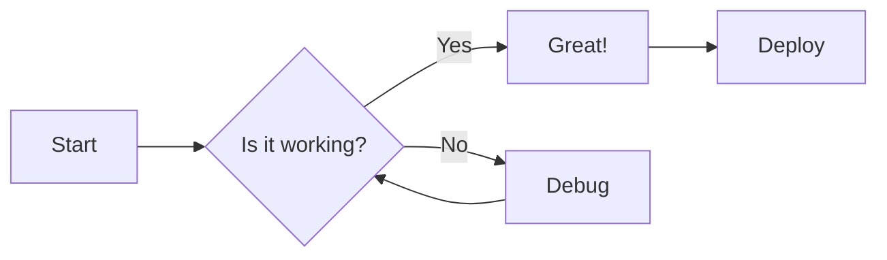
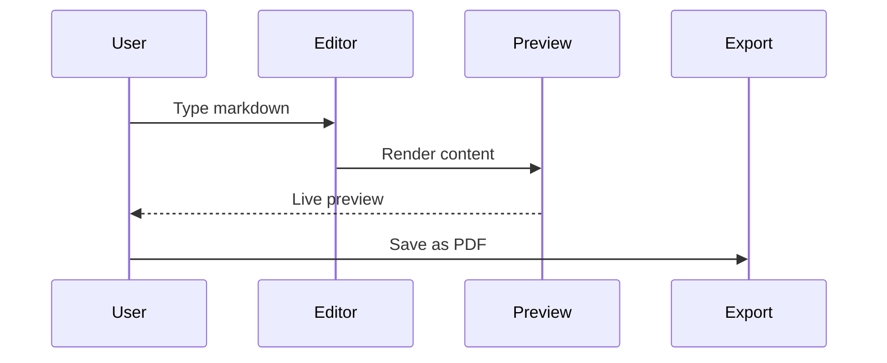

# Markdown Cheat Sheet: Syntax, Math & Diagrams

A copy-ready guide to Markdown, GFM, LaTeX math, Mermaid diagrams, and inline HTML. Edit any example to see it rendered live.

## Headings

# Heading 1
## Heading 2
### Heading 3
#### Heading 4
##### Heading 5
###### Heading 6

## Text Formatting

**Bold text** using `**text**`

*Italic text* using `*text*`

***Bold and italic*** using `***text***`

~~Strikethrough~~ using `~~text~~`

Inline `code` using backticks

## Links and Images

[Markdown Viewer](https://markdownviewer.org) - click to visit

Auto-linked URL: https://markdownviewer.org

## Lists

### Ordered List

1. First item
2. Second item
3. Third item
    1. Indented item
    2. Another indented item
4. Fourth item

### Unordered List

- Apple
- Banana
    - Yellow banana
    - Green banana
- Cherry

### Task List

- [x] Write the documentation
- [x] Add syntax highlighting
- [ ] Review pull request
- [ ] Deploy to production

## Blockquotes

> "The best way to predict the future is to invent it." - Alan Kay

Nested blockquotes:

> First level
> > Second level
> > > Third level

## Tables

| Feature           | Supported |  Notes              |
|:------------------|:---------:|--------------------:|
| GFM Tables        | Yes       | Full support        |
| Left aligned      | Yes       | Use `:---`          |
| Center aligned    | Yes       | Use `:---:`         |
| Right aligned     | Yes       | Use `---:`          |

## Code Blocks

### JavaScript

```javascript
function greet(name) {
  const message = `Hello, ${name}!`;
  console.log(message);
  return message;
}
```

### Python

```python
def fibonacci(n):
    a, b = 0, 1
    for _ in range(n):
        yield a
        a, b = b, a + b

print(list(fibonacci(10)))
```

### JSON

```json
{
  "name": "Markdown Viewer",
  "version": "1.0.0",
  "features": ["preview", "export", "themes"]
}
```

## Mathematical Expressions

Inline math: $E = mc^2$ and $\alpha + \beta = \gamma$

Display equations:

$$\frac{\partial f}{\partial x} = \lim_{h \to 0} \frac{f(x+h) - f(x)}{h}$$

$$\sum_{i=1}^{n} i^2 = \frac{n(n+1)(2n+1)}{6}$$

$$\int_{-\infty}^{\infty} e^{-x^2} dx = \sqrt{\pi}$$

## Mermaid Diagrams

### Flowchart



### Sequence Diagram



## HTML Elements

Superscript: x<sup>2</sup> + y<sup>2</sup> = z<sup>2</sup>

Subscript: H<sub>2</sub>O, CO<sub>2</sub>

Keyboard keys: Press <kbd>Ctrl</kbd> + <kbd>S</kbd> to save

<abbr title="Hypertext Markup Language">HTML</abbr> abbreviation with tooltip

<mark>Highlighted text</mark> for emphasis

## Horizontal Rules

Three different syntaxes all produce horizontal rules:

---

***

___

## Escaping Characters

Use backslash to display literal characters:

\*Not italic\* and \*\*not bold\*\*

\# Not a heading

\- Not a list item
