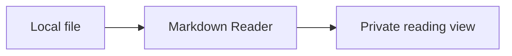

# Fixture library

[Chapter details](guides/Chapter%20One.md#details)

[External reference](https://example.com/)

- [x] Folder navigation works
- [ ] More reading

| Feature | Status |
| --- | --- |
| Tables | Ready |

```ts
const localOnly = true;
```


